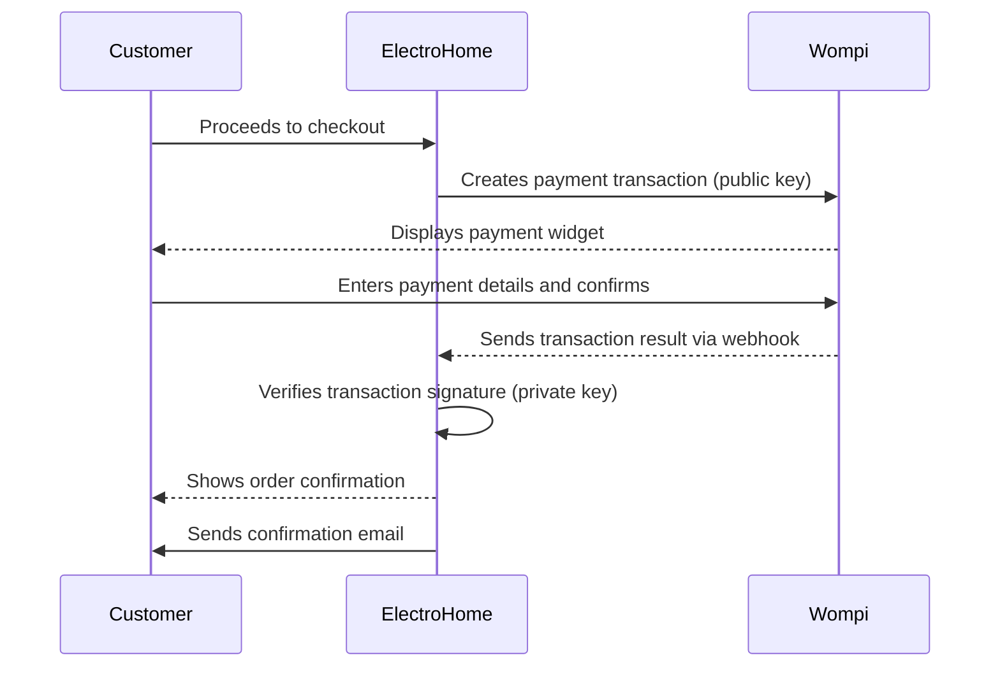

ElectroHome uses [Wompi](https://wompi.co) as its payment gateway. Wompi is a Colombian payment processor that supports credit cards, PSE bank transfers, Bancolombia transfers, Nequi, and cash payments (Efecty). The integration supports both sandbox testing and live production payments.

## Supported payment methods

<Columns cols={3}>
  <Card title="Credit and debit cards" icon="credit-card">
    Visa, Mastercard, and American Express cards
  </Card>
  <Card title="PSE" icon="building-columns">
    Direct bank transfers from Colombian banks via PSE
  </Card>
  <Card title="Bancolombia" icon="money-bill-transfer">
    Payments via Bancolombia transfer button
  </Card>
  <Card title="Nequi" icon="mobile">
    Mobile wallet payments via Nequi
  </Card>
  <Card title="Efecty" icon="store">
    Cash payments at Efecty collection points
  </Card>
  <Card title="Daviplata" icon="wallet">
    Payments via Daviplata digital wallet
  </Card>
</Columns>

## Test vs. production environments

Wompi provides a sandbox environment for testing without processing real transactions. You control which environment is active with the `WOMPI_ENVIRONMENT` setting.

<Tabs>
  <Tab title="Test (sandbox)">
    The default environment for development. No real money moves. Use Wompi's test card numbers to simulate successful and failed payments.

    ```bash
    WOMPI_ENVIRONMENT=test
    ```

    The sandbox API is available at `https://sandbox.wompi.co/v1`. Your sandbox API keys start with `pub_test_` and `prv_test_`.

    <Note>
    Test API keys only work against the sandbox API. They will be rejected in production.
    </Note>
  </Tab>
  <Tab title="Production">
    Processes real payments. Set this only after you have completed Wompi's merchant onboarding and received your production API keys.

    ```bash
    WOMPI_ENVIRONMENT=production
    ```

    Your production API keys start with `pub_prod_` and `prv_prod_`.

    <Warning>
    Never use production keys in a development or staging environment. Production transactions charge real payment methods.
    </Warning>
  </Tab>
</Tabs>

## Obtaining Wompi API keys

<Steps>
  <Step title="Create a Wompi account">
    Go to [wompi.co](https://wompi.co) and sign up for a merchant account. For sandbox testing, you can register without completing the full merchant verification.
  </Step>
  <Step title="Access the developer dashboard">
    Log in to your Wompi dashboard and navigate to **Developers** > **API keys**.
  </Step>
  <Step title="Copy your sandbox keys">
    Copy the **Public key** (starts with `pub_test_`) and **Private key** (starts with `prv_test_`) from the sandbox section.
  </Step>
  <Step title="Set the environment variables">
    Add the keys to your environment:

    ```bash
    WOMPI_PUBLIC_KEY=pub_test_your_key_here
    WOMPI_PRIVATE_KEY=prv_test_your_key_here
    WOMPI_ENVIRONMENT=test
    ```
  </Step>
  <Step title="Get production keys (when ready)">
    Complete Wompi's merchant verification process. Once approved, copy your production keys from **Developers** > **API keys** in the production section.
  </Step>
</Steps>

<Warning>
Never commit your `WOMPI_PRIVATE_KEY` to version control. Store it exclusively as an environment variable. Anyone with your private key can initiate payment refunds and access transaction data on your behalf.
</Warning>

## Payment flow

The following describes the complete flow from cart to order confirmation:



### Step-by-step payment flow

<Steps>
  <Step title="Customer proceeds to checkout">
    The customer reviews their cart and clicks **Proceed to checkout**. ElectroHome creates a pending order record.
  </Step>
  <Step title="Wompi widget loads">
    ElectroHome initializes the Wompi payment widget using the public key (`WOMPI_PUBLIC_KEY`). The widget displays payment method options.
  </Step>
  <Step title="Customer completes payment">
    The customer selects a payment method, enters their details in the Wompi-hosted widget, and confirms. The payment is processed by Wompi's servers.
  </Step>
  <Step title="Wompi sends a webhook">
    Wompi sends a webhook notification to ElectroHome with the transaction result (approved, declined, or pending).
  </Step>
  <Step title="Transaction is verified">
    ElectroHome verifies the webhook signature using `WOMPI_PRIVATE_KEY` to confirm the notification is genuine.
  </Step>
  <Step title="Order is confirmed">
    If the transaction is approved, the order status updates to **Processing** and a confirmation email is sent to the customer.
  </Step>
</Steps>

## Going live

When you are ready to accept real payments:

1. Complete Wompi merchant verification at [wompi.co](https://wompi.co)
2. Replace your test API keys with production keys in your environment variables
3. Set `WOMPI_ENVIRONMENT=production`
4. Test with a real low-value transaction to confirm end-to-end flow
5. Monitor your first transactions in the Wompi dashboard

<Tip>
Before going live, test your webhook endpoint to make sure order confirmations work correctly. Wompi's dashboard lets you resend webhook events for any transaction.
</Tip>

## Related pages

<Columns cols={2}>
  <Card title="Shopping cart" icon="cart-shopping" href="/features/shopping-cart">
    Cart management and order creation before payment
  </Card>
  <Card title="Environment variables" icon="key" href="/configuration/environment-variables">
    Set WOMPI_PUBLIC_KEY, WOMPI_PRIVATE_KEY, and WOMPI_ENVIRONMENT
  </Card>
</Columns>
