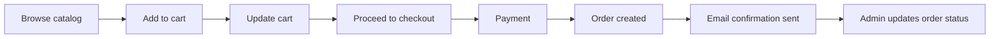

ElectroHome includes a full shopping cart and order management system. Customers can add products to their cart, adjust quantities, and place orders. Once an order is placed, the customer receives an email confirmation. Admins manage order status from the Django admin panel.

## Cart and order workflow



## Shopping cart operations

### Adding products to the cart

Customers add products to their cart from two places:

- The **catalog page** — click **Add to cart** on any product listing
- The **product detail page** — click **Add to cart** after reviewing the full description

Products are added with a default quantity of 1. If the same product is added again, the quantity increments.

### Updating quantities

In the cart view, customers can:

- **Increase or decrease quantity** using the quantity controls next to each item
- **Remove an item** by clicking the remove button, which sets the quantity to zero and removes the line from the cart

<Note>
Cart contents persist for authenticated users. If a customer is not logged in, they are prompted to sign in before completing their purchase.
</Note>

### Viewing the cart

Customers access their cart at any time by clicking the cart icon in the navigation bar. The cart summary shows:

- Each item with its name, unit price, and selected quantity
- Line totals (unit price × quantity)
- Order subtotal
- A **Proceed to checkout** button

## Order creation

When a customer completes payment, the system creates an order record that captures:

- Customer details (name, email)
- Shipping address
- Ordered items and quantities
- Unit prices at the time of purchase
- Order total
- Payment status
- Order creation timestamp

<Tip>
Prices are recorded at the time of purchase. If you update a product price later, existing orders are not affected.
</Tip>

## Order status management

Admins manage all orders from the Django admin panel at `/admin/`.

### Updating an order's status

<Steps>
  <Step title="Open the admin panel">
    Navigate to `/admin/` and click **Orders** in the sidebar.
  </Step>
  <Step title="Find the order">
    Use the search bar or filter by date, status, or customer email to locate the order.
  </Step>
  <Step title="Open the order">
    Click the order ID to open the order detail view.
  </Step>
  <Step title="Update the status">
    Change the **Status** field to the appropriate value (for example, **Processing**, **Shipped**, or **Delivered**).
  </Step>
  <Step title="Save">
    Click **Save** to apply the update. An email notification is sent to the customer if status-change notifications are configured.
  </Step>
</Steps>

### Order statuses

| Status | Description |
|--------|-------------|
| Pending | Order placed, awaiting payment confirmation |
| Processing | Payment confirmed, order being prepared |
| Shipped | Order dispatched to the customer |
| Delivered | Customer has received the order |
| Cancelled | Order cancelled by admin or customer |

## Order history

Customers can view their order history from their account page. Each order shows:

- Order ID and date
- Items ordered with quantities and prices
- Current order status
- Total amount paid

Admins can view all orders across all customers from `/admin/`.

## Email notifications

ElectroHome sends transactional emails using Gmail SMTP for:

- **Order confirmation** — sent to the customer immediately after a successful order
- **Status updates** — sent when an admin updates the order status (if configured)

```python
# Gmail SMTP configuration
EMAIL_BACKEND = 'django.core.mail.backends.smtp.EmailBackend'
EMAIL_HOST = 'smtp.gmail.com'
EMAIL_PORT = 465
EMAIL_USE_SSL = True
```

<Warning>
You must configure `EMAIL_HOST_USER` and `EMAIL_HOST_PASSWORD` in your environment variables for email delivery to work. Use a Gmail App Password rather than your account password when two-factor authentication is enabled on your Gmail account.
</Warning>

## Related pages

<Columns cols={2}>
  <Card title="Payments" icon="credit-card" href="/features/payments">
    How checkout and payment processing works with Wompi
  </Card>
  <Card title="Product catalog" icon="store" href="/features/product-catalog">
    How products are managed and browsed
  </Card>
</Columns>
